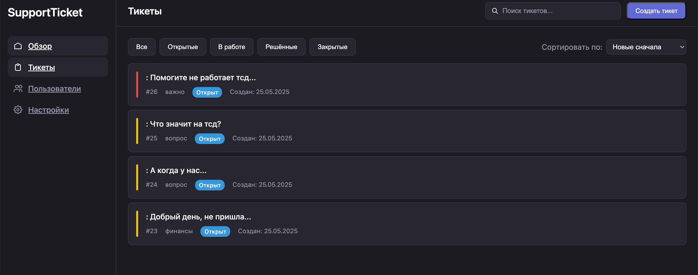
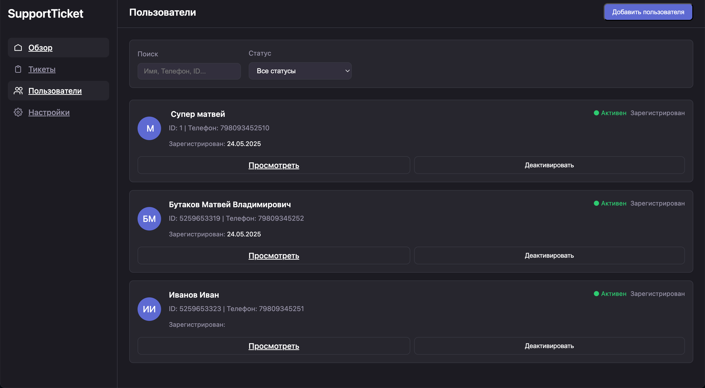
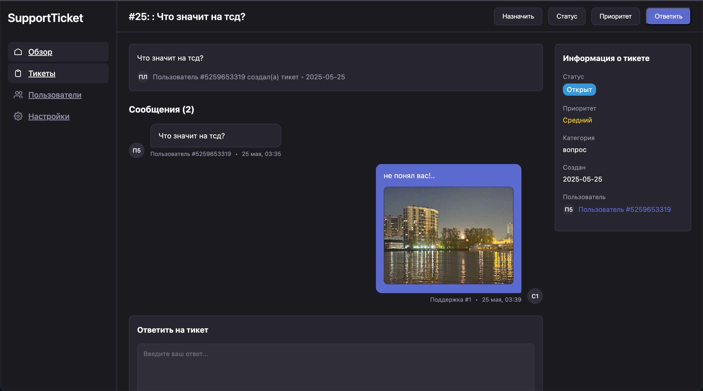

# Support Site Front For 1D

Фронтенд-приложение для системы поддержки пользователей, разработанное с использованием Qwik Framework.

## 📸 Скриншоты

### Панель администратора

*Главная страница панели администратора с обзором тикетов и статистикой*

### Просмотр тикета

*Страница просмотра тикета с диалогом в стиле мессенджера*

### Список пользователей

*Страница управления пользователями*

## 🚀 Основные возможности

- 💬 Система тикетов с диалогами в стиле мессенджера
- 📊 Панель администратора с статистикой и обзором
- 👥 Управление пользователями
- 📎 Поддержка вложений (изображения)
- 🔍 Фильтрация и поиск тикетов
- 🏷️ Категоризация и приоритеты тикетов
- 📱 Адаптивный дизайн

## 🛠 Технологии

- [Qwik](https://qwik.builder.io/) - Фреймворк для создания быстрых веб-приложений
- [TypeScript](https://www.typescriptlang.org/) - Типизированный JavaScript
- [Vite](https://vitejs.dev/) - Сборщик и инструмент разработки
- CSS-in-JS для стилизации компонентов

## 🏗 Установка и запуск

1. Клонируйте репозиторий:
```bash
git clone https://github.com/yourusername/SupportSIteFrontFor1d.git
cd SupportSIteFrontFor1d
```

2. Установите зависимости:
```bash
npm install
```

3. Запустите приложение в режиме разработки:
```bash
npm run dev
```

4. Для сборки проекта:
```bash
npm run build
```

5. Для запуска собранного проекта:
```bash
npm run serve
```

## 📁 Структура проекта

```
SupportSIteFrontFor1d/
├── src/
│   ├── components/     # Переиспользуемые компоненты
│   ├── routes/         # Маршруты приложения
│   │   ├── admin/     # Компоненты панели администратора
│   │   └── user/      # Пользовательские компоненты
│   ├── global.css     # Глобальные стили
│   └── root.tsx       # Корневой компонент
├── public/            # Статические файлы
├── server/           # Серверная часть для SSR
└── package.json      # Зависимости и скрипты
```

## 🔧 Конфигурация

Основные настройки проекта находятся в следующих файлах:
- `vite.config.ts` - конфигурация Vite
- `tsconfig.json` - настройки TypeScript
- `.env` - переменные окружения (создайте из .env.example)

## 🌐 API Endpoints

Приложение взаимодействует со следующими API endpoints:

- `GET /api/tickets` - получение списка тикетов
- `GET /api/tickets/:id` - получение информации о тикете
- `POST /api/tickets/:id/messages` - отправка сообщения
- `POST /api/tickets/:id/photos` - загрузка изображений
- `GET /api/users` - получение списка пользователей
- `GET /api/users/:id` - получение информации о пользователе

## 👥 Роли пользователей

- **Администратор**: полный доступ к системе
- **Агент поддержки**: работа с тикетами
- **Пользователь**: создание и просмотр своих тикетов

## 🎨 Темы оформления

Приложение поддерживает светлую и темную темы. Цветовая схема настраивается через CSS-переменные:

```css
:root {
  --color-primary: #007bff;
  --color-background: #ffffff;
  --color-text: #333333;
  /* ... другие переменные ... */
}
```

## 📱 Адаптивность

Приложение адаптировано для различных устройств:
- Десктоп (>1200px)
- Планшет (768px - 1199px)
- Мобильные устройства (<767px)

## 🔒 Безопасность

- Все API-запросы защищены токенами авторизации
- Реализована защита от XSS-атак
- Валидация загружаемых файлов
- Ограничение размера загружаемых файлов

## 🤝 Вклад в проект

1. Форкните репозиторий
2. Создайте ветку для новой функциональности
3. Внесите изменения
4. Создайте Pull Request

## 📄 Лицензия

MIT License - см. [LICENSE](LICENSE) файл для подробностей.

## 📞 Поддержка

При возникновении вопросов или проблем создайте Issue в репозитории или свяжитесь с командой разработки.

## 🔄 История изменений

См. [CHANGELOG.md](CHANGELOG.md) для списка изменений.

---
Разработано с ❤️ командой mbutakov