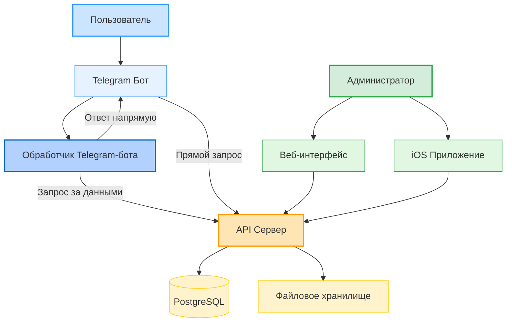

# 🎯 Комплексная система поддержки пользователей

Полнофункциональная система поддержки пользователей, состоящая из четырех взаимосвязанных компонентов:
веб-интерфейса, API-сервера, Telegram-бота и iOS-приложения.


## 📚 Содержание

- [Обзор системы](#-обзор-системы)
- [Компоненты системы](#-компоненты-системы)
- [Архитектура](#-архитектура)
- [Установка и настройка](#-установка-и-настройка)
- [API Документация](#-api-документация)
- [Скриншоты](#-скриншоты)
- [Разработка](#-разработка)
- [Лицензия](#-лицензия)

## 🌟 Обзор системы

Система поддержки пользователей предоставляет полный набор инструментов для организации службы поддержки:

- 💬 Многоканальное общение (веб, Telegram, iOS)
- 🎫 Система тикетов с категориями и приоритетами
- 👥 Управление пользователями и агентами поддержки
- 📸 Поддержка медиа-вложений (фото, документы)
- 📊 Статистика и аналитика
- 🔔 Уведомления о новых обращениях
- 🌐 Единый API для всех платформ

## 🧩 Компоненты системы

### 1. [SupportSIteFrontFor1d](https://github.com/mbutakov/SupportSIteFrontFor1d)
Веб-интерфейс для агентов поддержки
- **Технологии**: Qwik, TypeScript, Vite
- **Особенности**: 
  - Современный адаптивный интерфейс
  - Чат в стиле мессенджера
  - Управление тикетами и пользователями
  - Загрузка и просмотр вложений

### 2. [SupportAPIFor1d](https://github.com/mbutakov/SupportAPIFor1d)
REST API сервер
- **Технологии**: Go, Gin, PostgreSQL
- **Особенности**:
  - RESTful API
  - Работа с файлами
  - Авторизация и безопасность
  - Масштабируемая архитектура

### 3. [SupportBotFor1d](https://github.com/mbutakov/SupportBotFor1d)
Telegram бот для пользователей
- **Технологии**: Go, Telegram Bot API
- **Особенности**:
  - Регистрация пользователей
  - Создание и управление тикетами
  - Отправка фото и документов
  - Интеграция с основным API

### 4. [1dApp](https://github.com/mbutakov/1dApp)
iOS приложение
- **Технологии**: Swift, SwiftUI, Combine
- **Особенности**:
  - Нативный iOS интерфейс
  - Поддержка iOS 17+
  - Офлайн режим
  - Push-уведомления

## 🏗 Архитектура



### Взаимодействие компонентов

1. **API Сервер** является центральным звеном системы
2. **Веб-интерфейс**, **Telegram-бот** и **iOS-приложение** работают через API
3. Все данные хранятся в единой **PostgreSQL** базе данных
4. Файлы и медиа хранятся в отдельном хранилище

## 🚀 Установка и настройка

### Предварительные требования

- PostgreSQL 12+
- Go 1.16+
- Node.js 16+
- Xcode 15+ (для iOS)
- Docker (опционально)

### 1. Настройка базы данных

```bash
# Создание базы данных
psql -U postgres
CREATE DATABASE support_system;
\q

# Применение схемы
psql -U postgres -d support_system -f schema.sql
```

### 2. Запуск API сервера

```bash
cd SupportAPIFor1d
go mod download
go run main.go
```

### 3. Запуск веб-интерфейса

```bash
cd SupportSIteFrontFor1d
npm install
npm run dev
```

### 4. Настройка Telegram бота

```bash
cd SupportBotFor1d
cp config.example.json config.json
# Настройте config.json
go run main.go
```

### 5. Сборка iOS приложения

```bash
cd 1dApp
pod install
open 1dApp.xcworkspace
```

## 📡 API Документация

Подробная документация API доступна в формате OpenAPI (Swagger):
- [API Documentation](https://api-docs.example.com)

### Основные эндпоинты

| Метод | Endpoint | Описание |
|-------|----------|----------|
| GET | `/api/tickets` | Список тикетов |
| GET | `/api/tickets/:id` | Информация о тикете |
| POST | `/api/tickets` | Создание тикета |
| GET | `/api/users` | Список пользователей |
| POST | `/api/tickets/:id/messages` | Отправка сообщения |

## 📸 Скриншоты

### Веб-интерфейс

*Панель администратора*

### iOS Приложение


### Telegram Бот


### Панель администратора

*Главная страница панели администратора с обзором тикетов и статистикой*

### Просмотр тикета

*Страница просмотра тикета с диалогом в стиле мессенджера*

### Список пользователей

*Страница управления пользователями*

## 👨‍💻 Разработка

### Структура репозиториев

```
support-system/
├── SupportSIteFrontFor1d/   # Веб-интерфейс
├── SupportAPIFor1d/         # API сервер
├── SupportBotFor1d/        # Telegram бот
└── 1dApp/                  # iOS приложение
```

### Рекомендации по разработке

1. Используйте единый стиль кода
2. Следуйте семантическому версионированию
3. Пишите тесты для критического функционала
4. Документируйте изменения в CHANGELOG.md

## 🔒 Безопасность

- Все API-запросы защищены токенами
- Валидация входных данных
- Безопасная работа с файлами
- Логирование действий
- Защита от XSS и CSRF

## 📈 Масштабирование

- Горизонтальное масштабирование API
- Кэширование частых запросов
- Оптимизация работы с БД
- Балансировка нагрузки

## 🤝 Вклад в проект

1. Форкните репозиторий
2. Создайте ветку для новой функции
3. Внесите изменения
4. Создайте Pull Request

## 📄 Лицензия

MIT License - см. [LICENSE](LICENSE) файл для подробностей.

## 👥 Авторы

- mbutakov - [@mbutakov](https://github.com/mbutakov)

---
Разработано с ❤️ командой mbutakov

## 🔄 История изменений

См. [CHANGELOG.md](CHANGELOG.md) для списка изменений.

---
Разработано с ❤️ командой mbutakov
